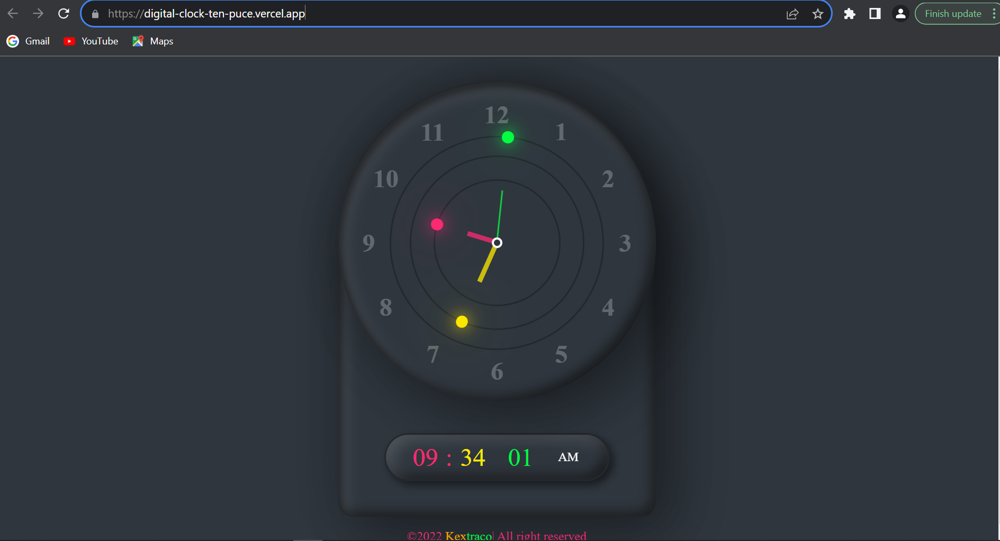

# DigitalClock
# Digital Clock Readme



## Table of Contents

1. [Overview](#overview)
2. [Features](#features)
3. [Usage](#usage)
4. [Contributing](#contributing)

## Overview

The Digital Clock project is a simple yet useful web application that displays the current time and date in a digital format. It provides an easy way for users to check the time at a glance, making it a handy addition to websites, applications, or personal dashboards.

## Features

- **Real-time Clock**: The digital clock displays the current time with real-time updates.
- **Date Display**: Along with the time, the current date is also shown.
- **User-Friendly Design**: The interface is clear and easy to read, making it suitable for a wide range of applications.

## Usage

1. Clone the repository to your local machine:

   ```bash
   git clone https://github.com/yourusername/digital-clock.git
   ```

2. Open the project folder in your code editor.

3. Open the `index.html` file in your web browser to start using the digital clock.

4. The clock will display the current time and date. It updates in real-time, so you always have an accurate display.


## Contributing

If you want to contribute to this project, follow these steps:

1. Fork the repository to your GitHub account.

2. Clone the forked repository to your local machine:

   ```bash
   git clone https://github.com/yourusername/digital-clock.git
   ```

3. Create a new branch for your changes:

   ```bash
   git checkout -b feature/your-feature
   ```

4. Make your changes and commit them with descriptive commit messages.

5. Push your changes to your fork on GitHub:

   ```bash
   git push origin feature/your-feature
   ```

6. Create a pull request on the original repository to propose your changes.


Enjoy the convenience of a digital clock on your website or application! [Digital clock demo](https://digital-clock-ten-puce.vercel.app/) If you have any questions or feedback, feel free to contact the project maintainers.

